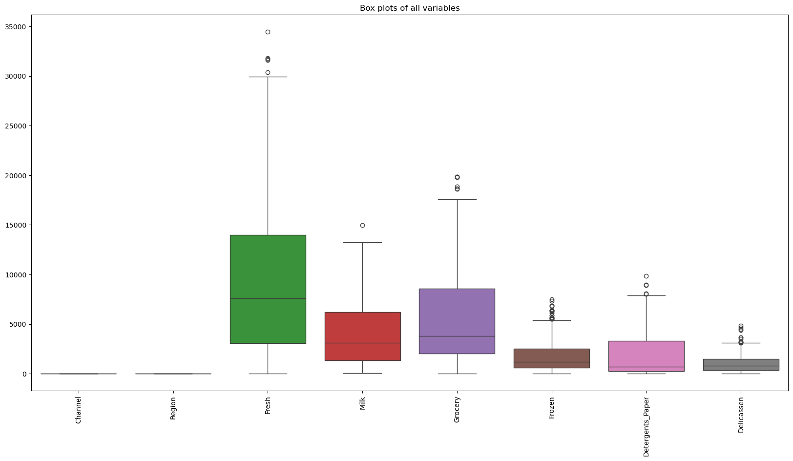
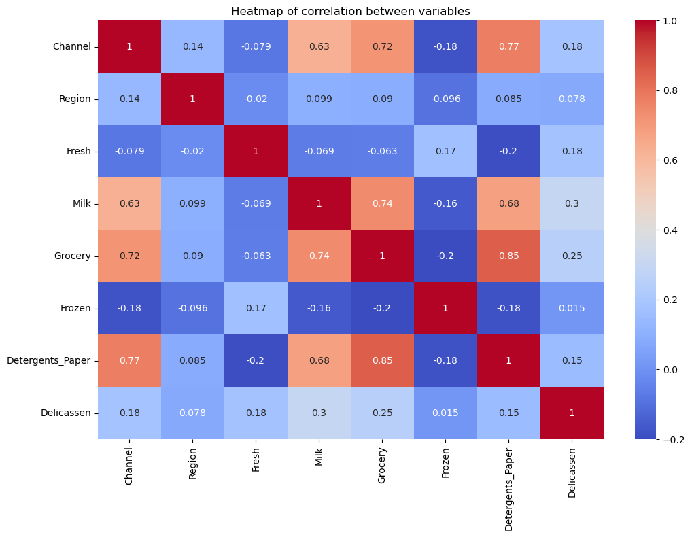
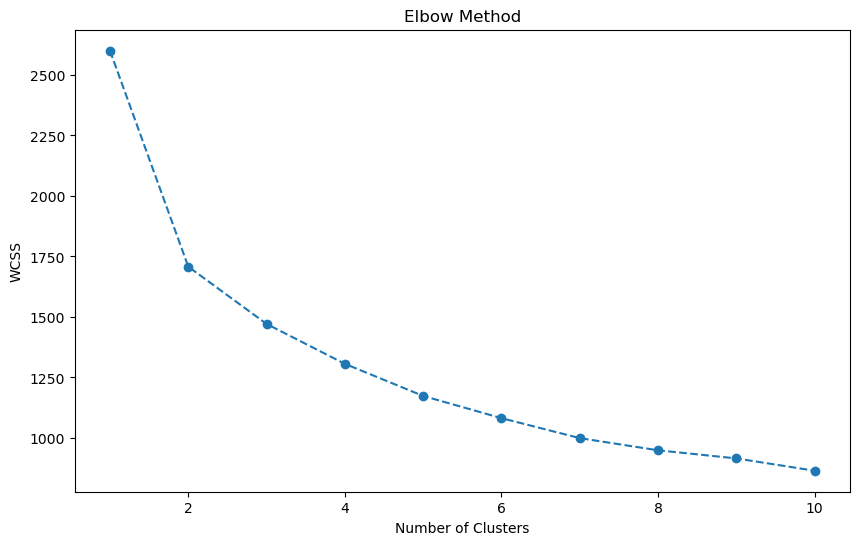
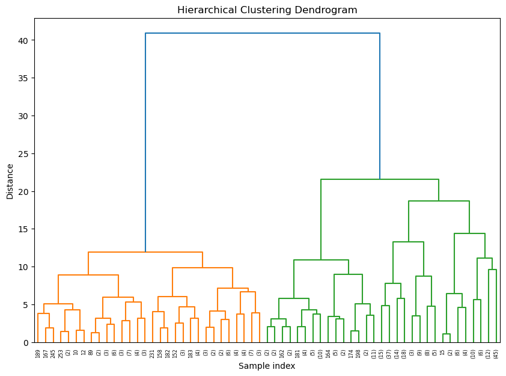
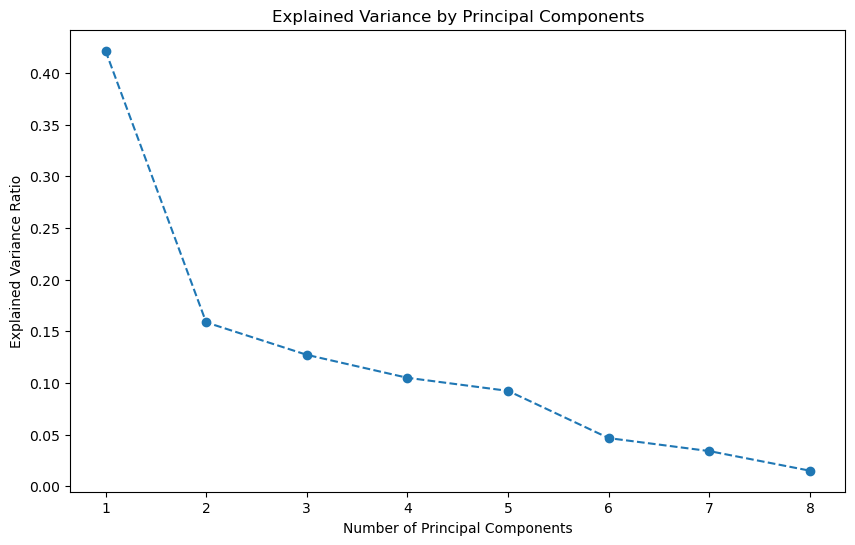

## Project Outcomes
- Unsupervised Learning: perform unsupervised learning techniques on a wholesale data dataset. The project involves four main parts: exploratory data analysis and pre-processing, KMeans clustering, hierarchical clustering, and PCA.
### Project Description:
In this project, we will apply unsupervised learning techniques to a real-world data set and use data visualization tools to communicate the insights gained from the analysis.

The data set for this project is the "Wholesale Data" dataset containing information about various products sold by a grocery store.
The project will involve the following tasks:

-	Exploratory data analysis and pre-processing: We will import and clean the data sets, analyze and visualize the relationships between the different variables, handle missing values and outliers, and perform feature engineering as needed.
-	Unsupervised learning: We will use the Wholesale Data dataset to perform k-means clustering, hierarchical clustering, and principal component analysis (PCA) to identify patterns and group similar data points together. We will determine the optimal number of clusters and communicate the insights gained through data visualization.

The ultimate goal of the project is to gain insights from the data sets and communicate these insights to stakeholders using appropriate visualizations and metrics to make informed decisions based on the business questions asked."
## Project Results: 
- Data Cleaning: The Wholesale dataset was checked for null and negative values. The dataset was found to have no missing values, indicating that it was well-maintained and ready for analysis without the need for removal of rows/columns.  Each column was checked for negative values. In the context of a grocery sales dataset, negative values would be illogical and would need to be corrected or removed.  The dataset was found to have no negative values, which further confirmed that the data was clean and reliable for analysis.
- Challenges: The dataset was quite easy to work with, no pitfalls or traps!
- Outlier Detection: My analysis of the outliers was best observed using box plots. These gave me the rows that were out of the quartile range. I found 115 outliers that I eliminated from the dataset. 

- Correlation Analysis: The heatmap showed a the biggest correlation was between Grocery and Fresh at 0.85, this means that as the sales of grocery items increase, the sales of detergents and paper products also tend to increase. This strong correlation suggests that customers who purchase grocery items are also likely to purchase detergents and paper products. This could be due to the fact that these items are often bought together during regular shopping trips. I assumed that there would be a bigger correlation between Fresh and Milk but that was a negative relationship, there could be seasonal variations affecting the sales of these items differently. 

- Clustering Analysis: 
- K-Means Clustering: Process: K-Means clustering was performed on the dataset to group similar products into clusters based on their attributes. The Elbow Method was used to determine the optimal number of clusters by plotting the within-cluster sum of squares (WCSS) against the number of clusters.
Findings: The K-Means clustering map showed roughly 4 clusters. This was determined by identifying the "elbow point" in the Elbow Method graph, where the WCSS starts to decrease more slowly. 

- Hierarchical clustering was performed using the Ward's method, and the results were visualized using a dendrogram. The dendrogram helps in understanding the hierarchical structure of the clusters and determining the optimal number of clusters by visually inspecting the tree-like diagram.
Findings: The hierarchical clustering dendrogram showed only 3 clusters after visually cutting it off at a certain height. This cut-off point was chosen based on where the branches of the dendrogram start to merge at a higher distance, indicating distinct clusters. 

- Principal Component Analysis (PCA): Process: PCA was performed to reduce the dimensionality of the dataset and identify the most important features contributing to the overall variance. The explained variance ratio plot was used to determine the number of principal components that capture a significant portion of the variance. Findings: PCA had 9 components, with the tail-off happening around 5 components. This means that the first 5 principal components capture most of the variance in the dataset, and additional components contribute less significantly. 

- Conclusion: "Through comprehensive exploratory data analysis and the application of unsupervised learning techniques, we successfully identified distinct patterns and clusters within the Wholesale Data dataset, providing valuable insights for informed decision-making in the grocery retail sector."